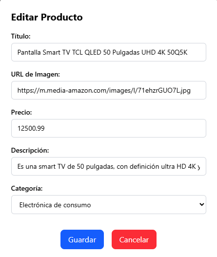

# TotalPlay - Frontend de Tienda Electrónica

## Introducción

Este proyecto representa la capa frontend de una aplicación web para la gestión de productos electrónicos. Forma parte de una prueba técnica enfocada en el uso de tecnologías modernas como Next.js 15, React 19, Tailwind CSS 4 y Zustand para el manejo del estado global.

## Descripción del Proyecto

* **Qué**: Aplicación SPA que permite crear, leer, actualizar y eliminar productos en una tienda electrónica.
* **Por qué:** Para demostrar competencia en herramientas actuales del ecosistema frontend.
* **Cómo**: A través de una estructura modular, consumo de API REST y uso avanzado de Tailwind CSS con enfoque CSS-first.

## Funcionalidad





## Prerequisitos para la ejecucion

Para la ejecucion de este proyecto es necesario los siguientes programas y pasos

1. Tener git instalado y hacer un clone del proyecto
2. Docker
3. Nodejs

### Ejecucion con docker

Ejecutar el comando para la ejecucion de la creacion de las imagenes, asi como la inicializacion del contenedor del proyecto

```
docker-compose up
```

Tambien puedes hacer uso del comando

```
docker compose -f 'docker-compose.yml' up -d --build
```

### Ejecucion sin docker

#### Frontend

Para la ejecucion del frontend es necesario realizar los siguientes pasos en terminal

1. Posiciónate en la raíz del proyecto

```
   cd ruta/del/proyecto
```

2. Instala las dependencias

```
   npm install
```

3. Construye el proyecto

```
   npm run build
```

4. Ejecuta la app en producción

```
   node .next/standalone/server.js
```

5. Accede a la app
   [http://localhost:3000](http://localhost:3000)

#### Backend

Para la ejecucion del backend es necesario realizar los siguientes pasos en terminal

1. Posiciónate en la raíz del proyecto

```
   cd ruta/del/proyecto
```

2. Buildea
   En windows

```
gradlew.bat build --no-daemon
```

En mac

```
./gradlew build --no-daemon
```

3. Entrar en build/libs y obtener el nombre del archivo jar generado

```
java -jar build/libs/nombre-archivo.jar
```

## Servicios


| Endpoint               | Metodo | Descripcion                                    | Request                                                                            | Response                                                                                                                                                                                      | Response fallido                            |
| ---------------------- | ------ | ---------------------------------------------- | ---------------------------------------------------------------------------------- | --------------------------------------------------------------------------------------------------------------------------------------------------------------------------------------------- | ------------------------------------------- |
| **/api/products/**     | GET    | **Obtener una lista de todos los productos**  | NA                                                                                 | ` `  `[{"id": 1, "name": "Pantalla", "description": "Es una smart TV", "price": 12500.99, "imageUrl": "https://m.media-amazon.com/images/I/71ehzrGUO7L.jpg", "categoryId": 1}, {}.....]`  ` ` | NA                                          |
| **/api/products/**     | POST   | **Crear un nuevo producto**                    | **{"name": "Laptop Pro", "description": "...", "price": 1200.0, "categoryId": 1}** | **201 Created con el objeto del producto creado.**                                                                                                                                            | **400 Bad Request si la validación falla** |
| **/api/products/{id}** | GET    | **Obtener un producto por su ID.**             | NA                                                                                 | **200 OK con el objeto del producto actualizado**                                                                                                                                             | **404 Not Found si el producto no existe**  |
| **/api/products/{id}** | PUT    | **Actualizar un producto existente**           | **{"name": "Laptop Pro", "description": "...", "price": 1200.0, "categoryId": 1}** | **200 OK con el objeto del producto actualizado**                                                                                                                                             | **404 Not Found si el producto no existe**  |
| **/api/products/{id}** | DELETE | **Eliminar un producto por su ID.**            | NA                                                                                 | **204 No Content**                                                                                                                                                                            | **404 Not Found si el producto no existe**  |
| **/api/categories/**   | GET    | **Obtener una lista de todas las categorías** | NA                                                                                 | **200 OK con un array de objetos de categoría.**                                                                                                                                             | NA                                          |
| **/api/categories/**   | POST   | **Crear una nueva categoria**                  | **{"name": "Electrónicos"}**                                                      | **201 Created con el objeto del producto creado.**                                                                                                                                            | **400 Bad Request si la validación falla** |
| **/api/products/{id}** | GET    | **Obtener una categoria por su ID.**           | NA                                                                                 | **200 OK con el objeto de la categoría.**                                                                                                                                                    | **404 Not Found si el producto no existe**  |
| **/api/products/{id}** | PUT    | **Actualizar una categoría existente**        | **{"name": "Electrónicos"}**                                                      | **200 OK con el objeto del producto actualizado**                                                                                                                                             | **404 Not Found si el producto no existe**  |
| **/api/products/{id}** | DELETE | **Eliminar una categoría por su ID**          | NA                                                                                 | **204 No Content**                                                                                                                                                                            | **404 Not Found si el producto no existe**  |

## Tenologias

### Backend

Los proyectos backend tienen el siguiente stack tenologico para su funcionamiento

* **Lenguaje**: Java
* **Framework principal**: Spring Boot
* **Frameworks adicionales**: Spring Security, Spring Data JPA, Spring WebFlux, Spring Cloud Gateway
* **Librerías**: Lombok, JJWT, H2
* (Opcional ejecucion): Docker

### Frontend


* **Lenguaje**: TypeScript + JavaScript ESNext
* **Frameworks**: Next.js, React
* **Librerías de UI**: Tailwind CSS, Lucide, Radix Icons
* **Gestión de estado**: Zustand
* **HTTP**: Axios
* **Herramientas**: ESLint, TypeScript, PostCSS
* **Animaciones**: tw-animate-css

## Mantenimiento

### Frontend

* Este proyecto tiene uso de **UpperCamelCase** para componentes como modales y mas de UI reutilizable
* Este proyecto tiene uso de **LowerCamelCase** para componentes como vistas y archivos de configuracion
* Uso de **lowerCamelCase** para variables y funciones

### Backend

* Este proyecto tiene uso de **CamelCase** para los archivos y clases
* Uso de **lowerCamelCase** para variables
* Configuraciones de rutamiento asi como puertos en el archivo **application.properties**

### Adicionales

Se desarrollo un servicio de users el cual se penso para validar peticiones por medio de login, pero al ir en contra de las especificaciones tecnicas requeridas se descarto, si se desea hacer uso de las validaciones por parte del gateway estos son los pasos a seguir para su ejecucion

1. Comentar las reglas de enrutamiento del proyecto gateway en el archivo **application.properties**
2. Descomentar el archivo GatewayConfig del mismo proyecto
3. Agregar la dependencia del gateway en el docker-compose.yml sobre **user-service**
4. Despues de activar el servicio, todas las demas rutas deben contener el token en el request de la peticion siendo este un ejemplo
   `Authorization Bearer -Token-`

### Rutas


| Endpoint           | Metodo | Request                                                | Response      |
| ------------------ | ------ | ------------------------------------------------------ | ------------- |
| /api/users/auth    | POST   | {"username": "yamiletest2","password": "yamiletest"  } | 200 Con token |
| api/users/register | POST   | {"username": "yamiletest2","password": "yamiletest"  } | 200 Con token |
